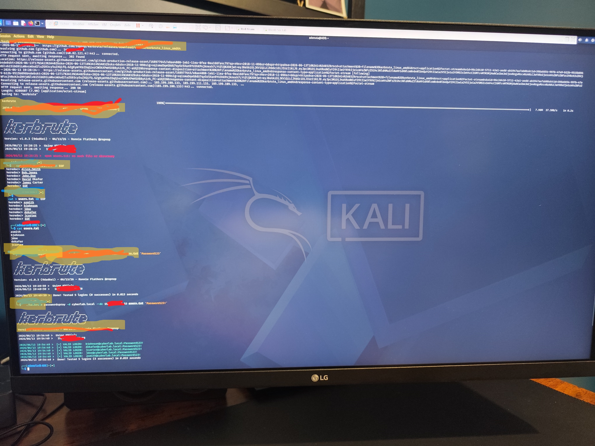
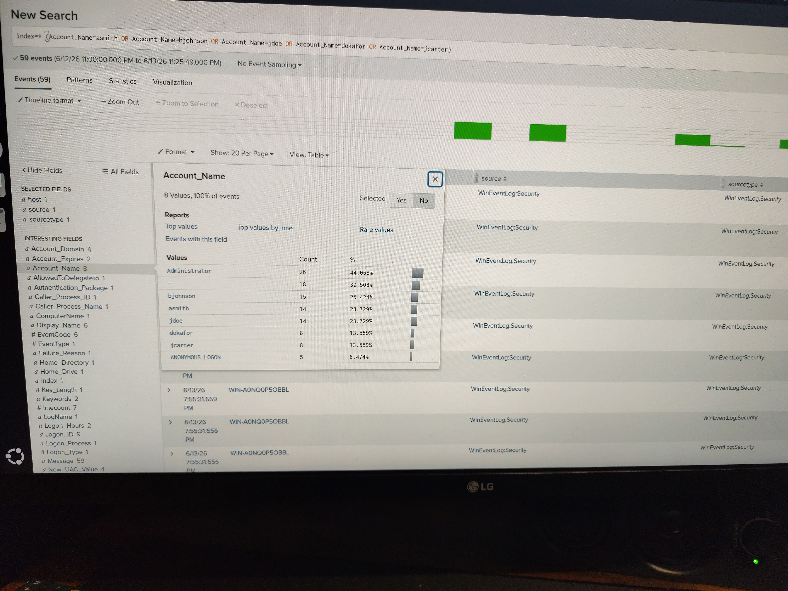
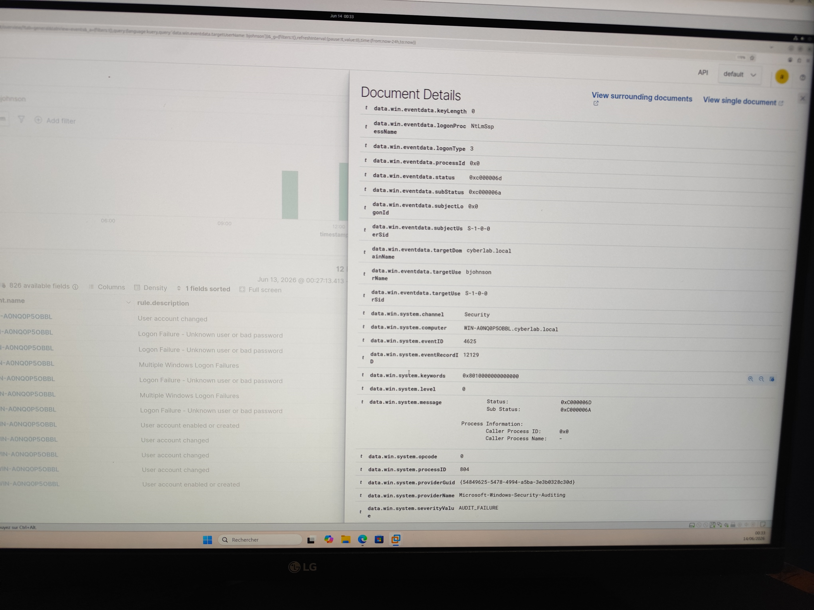
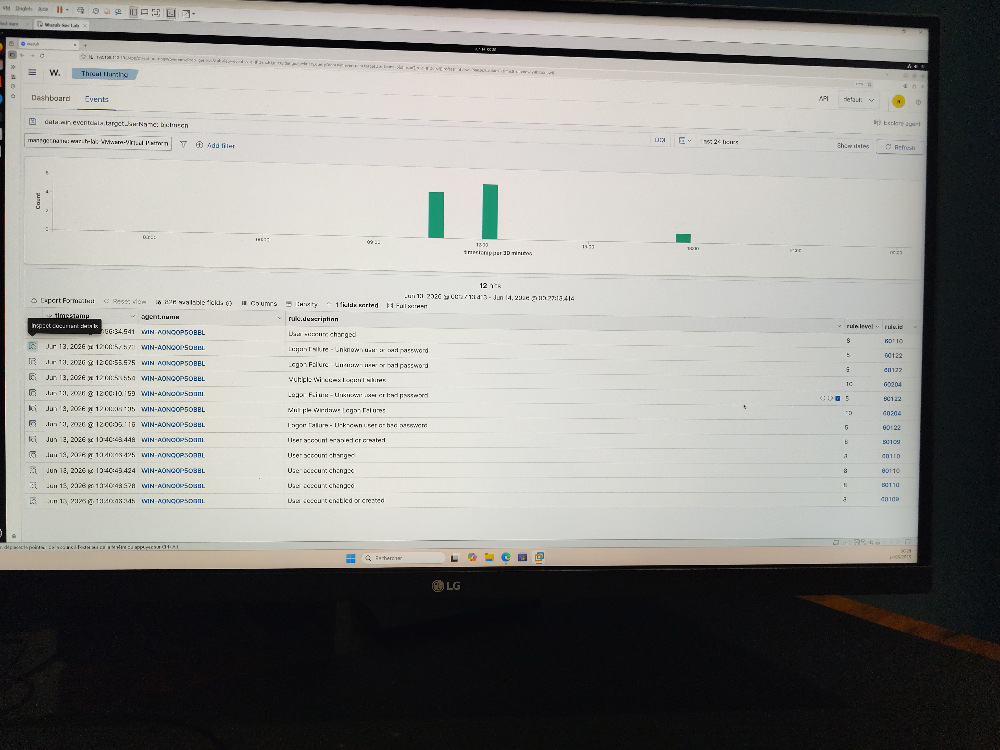

# Project 2 – Active Directory Password Spraying Detection Lab

## Overview

This project demonstrates how a password spraying attack against an Active Directory environment can be detected and investigated using Splunk Enterprise and Wazuh.

The objective was to simulate a common Active Directory attack technique, generate Windows authentication events, and validate the effectiveness of SIEM monitoring and threat detection capabilities.

---

## Lab Environment

| System            | Role                               |
| ----------------- | ---------------------------------- |
| Kali Linux        | Attacker Machine                   |
| Windows Server    | Active Directory Domain Controller |
| Windows 11        | Target Workstation                 |
| Splunk Enterprise | SIEM Platform                      |
| Wazuh             | Threat Detection Platform          |
| OPNsense          | Firewall & Gateway                 |

---

## Methodology

### Step 1 – Lab Preparation

A dedicated Active Directory lab environment was configured consisting of:

* Windows Server acting as the Domain Controller
* Windows 11 workstation joined to the domain
* Kali Linux attack workstation
* Splunk Enterprise for log analysis
* Wazuh for threat detection and monitoring

Five test accounts were created to simulate a realistic enterprise environment.

---

### Step 2 – Password Spraying Attack Simulation

A password spraying attack was performed from Kali Linux using Kerbrute against multiple Active Directory user accounts.

Objectives:

* Simulate a common Active Directory attack technique
* Generate authentication failures
* Validate SIEM visibility and detection capabilities

MITRE ATT&CK Mapping:

* T1110.003 – Password Spraying

---

### Step 3 – Log Collection

Windows Security Events were collected and forwarded to both Splunk Enterprise and Wazuh.

Relevant Event IDs:

* Event ID 4625 – Failed Logon
* Event ID 4768 – Kerberos Ticket Granting Ticket (TGT) Request

---

### Step 4 – Investigation

The generated authentication events were investigated using Splunk and Wazuh.

Indicators identified:

* Multiple failed authentication attempts
* Repeated logons against multiple accounts
* Activity consistent with password spraying behavior
* User account attribution
* Source IP attribution

---

### Step 5 – Detection Validation

Both Splunk and Wazuh successfully collected and displayed the generated attack activity.

This confirmed:

* Proper log ingestion
* Successful event correlation
* Visibility into authentication failures
* Detection of password spraying behavior

---

## Detection Results

### Splunk

Splunk successfully identified Windows Event ID 4625 authentication failures against multiple accounts.

Investigation provided visibility into:

* Targeted accounts
* Authentication patterns
* Attack timeline
* Kerberos activity

### Wazuh

Wazuh successfully collected and analyzed Windows authentication failure events.

Generated alerts related to:

* Failed authentication attempts
* Suspicious login activity
* Account targeting patterns

Observed:

* Rule ID 60122
* Event ID 4625
* User attribution
* Source IP attribution

---

## Evidence

### Active Directory User Creation

*Insert Active Directory screenshot here*

### Kerbrute Password Spraying Attack

*Insert Kali Linux screenshot here*

### Splunk Investigation

*Insert Splunk screenshot here*

### Wazuh Detection

*Insert Wazuh dashboard screenshot here*

### Wazuh User Investigation

*Insert Wazuh event details screenshot here*

---

## MITRE ATT&CK Mapping

| Technique ID | Technique         |
| ------------ | ----------------- |
| T1110.003    | Password Spraying |

---

## Skills Demonstrated

### SOC Analyst

* Authentication Log Analysis
* Security Event Investigation
* Threat Hunting
* Incident Triage

### Detection Engineering

* Windows Event Analysis
* Splunk Investigation
* Wazuh Alert Analysis
* MITRE ATT&CK Mapping

### Security Engineering

* Active Directory Administration
* Authentication Infrastructure
* Security Monitoring Integration

---

## Key Takeaways

This project demonstrated how password spraying attacks generate identifiable Windows Security Events and how SIEM platforms can be used to investigate and detect this activity.

The exercise improved practical skills in:

* Attack Simulation
* Security Monitoring
* Event Investigation
* Detection Validation
* Active Directory Security Analysis

---

# 🇫🇷 Résumé Français

## Vue d'ensemble

Ce projet démontre comment une attaque de type Password Spraying contre un environnement Active Directory peut être détectée et analysée à l'aide de Splunk Enterprise et Wazuh.

L'objectif était de simuler une technique d'attaque fréquemment utilisée contre les environnements Windows d'entreprise et de valider les capacités de détection d'une plateforme SIEM.

---

## Environnement du laboratoire

| Système           | Rôle                                   |
| ----------------- | -------------------------------------- |
| Kali Linux        | Machine d'attaque                      |
| Windows Server    | Contrôleur de domaine Active Directory |
| Windows 11        | Poste de travail cible                 |
| Splunk Enterprise | Plateforme SIEM                        |
| Wazuh             | Plateforme de détection des menaces    |
| OPNsense          | Pare-feu et passerelle                 |

---

## Méthodologie

### Étape 1 – Préparation du laboratoire

Un environnement Active Directory complet a été mis en place comprenant :

* Un contrôleur de domaine Windows Server
* Un poste Windows 11 intégré au domaine
* Une machine Kali Linux pour les simulations d'attaque
* Splunk Enterprise pour l'analyse des journaux
* Wazuh pour la surveillance et la détection

Cinq comptes utilisateurs de test ont été créés afin de reproduire un environnement réaliste.

---

### Étape 2 – Simulation de l'attaque

Une attaque de type Password Spraying a été réalisée depuis Kali Linux à l'aide de l'outil Kerbrute.

Objectifs :

* Simuler une attaque Active Directory réelle
* Générer des événements d'authentification échouée
* Tester les capacités de détection du SIEM

MITRE ATT&CK :

* T1110.003 – Password Spraying

---

### Étape 3 – Collecte des journaux

Les journaux Windows ont été collectés puis transmis à Splunk et Wazuh.

Événements analysés :

* Event ID 4625 – Échec d'authentification
* Event ID 4768 – Demande de ticket Kerberos (TGT)

---

### Étape 4 – Analyse

Les événements générés ont été examinés dans Splunk et Wazuh.

Indicateurs observés :

* Multiples échecs d'authentification
* Tentatives répétées sur plusieurs comptes
* Comportement caractéristique d'une attaque Password Spraying

---

### Étape 5 – Validation de la détection

Les deux plateformes ont correctement détecté et enregistré l'activité générée.

Validation de :

* La collecte des journaux
* L'analyse des événements
* La visibilité de l'attaque
* Les capacités de détection

---

## Compétences démontrées

* Sécurité Active Directory
* Analyse des journaux Windows
* Investigation Splunk
* Surveillance Wazuh
* Threat Hunting
* Détection d'attaques
* Cartographie MITRE ATT&CK
* Opérations SOC

## Evidence

### Kerbrute Password Spraying Attack

### User List Creation

### Splunk Event Details

### Wazuh Detection 

## Key Takeaways

- Simulated a password spraying attack against Active Directory
- Investigated Windows Event ID 4625 authentication failures
- Correlated logs in Splunk and Wazuh
- Mapped activity to MITRE ATT&CK T1110.003
- Validated SIEM detection capabilities

